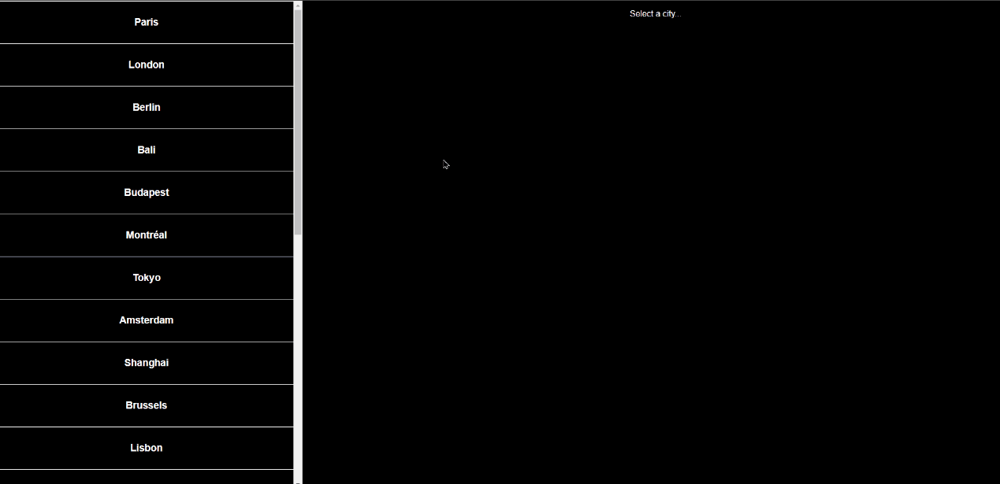

### Wagon Cities

The goal of this challenge was to create a React app that could display an image of the selected Le Wagon office.
The app uses Redux to store the app state.

Here's how it looks:

#### 1. Setup

The challenge used the Le Wagon [Redux boilerplate](https://github.com/lewagon/redux-boilerplate):

#### 2. Features

* When a user selects a city, an image is displayed of that city's office.
